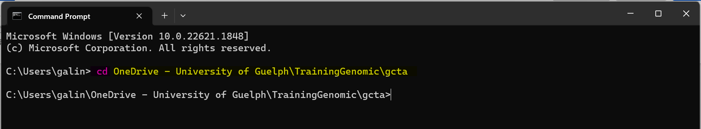
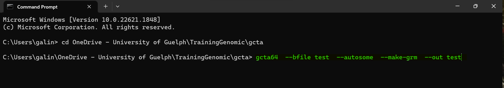
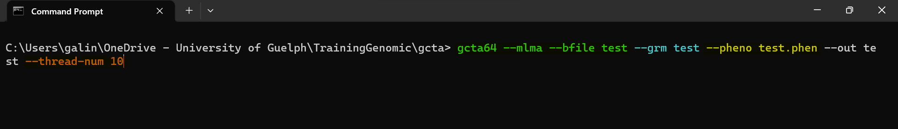
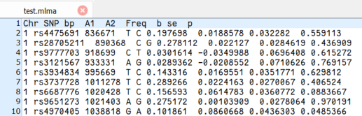
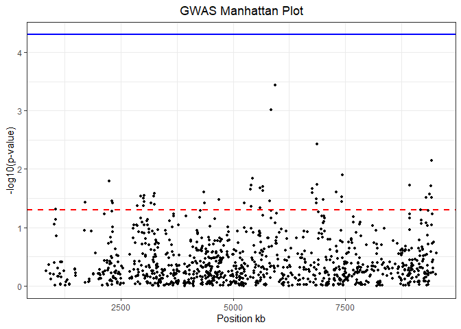
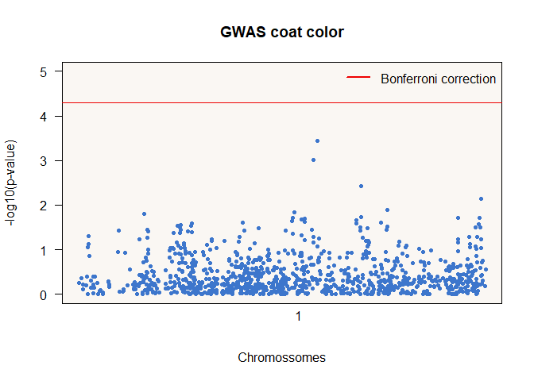
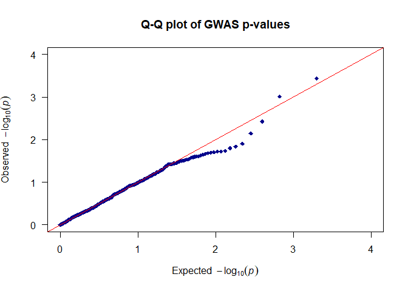
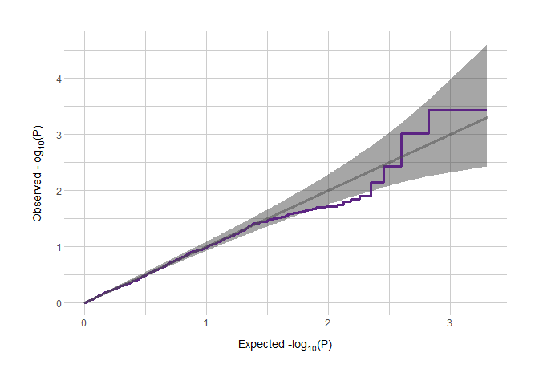
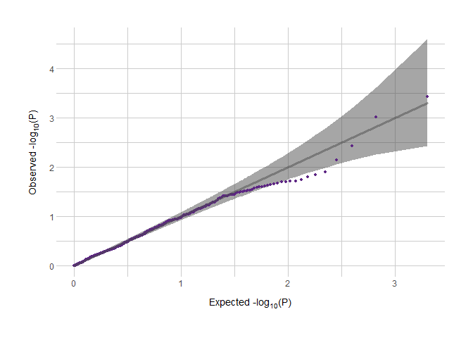

GWAS
================
BrunoGalindo
2023-07-12

# GWAS

1.  The first step you need to performe is downloading the GCTA zip
    folder from
    <https://yanglab.westlake.edu.cn/software/gcta/#Download>.
2.  Extract this zip folder in your computer. Make sure that all files
    are in the same directory and not in a subdirectory.
3.  Open the command line in your computer as the image below:


4.  Drive your command line to the directory where you saved your
    extracted folder with gcta using the command cd
    (<span style="background-color: black; color: hotpink;">pink</span>)
    and the path to your directory
    (<span style="background-color: black; color: yellow;">yellow</span>).



5.  The first thing to generate a GRM using the
    <span style="background-color: black; color: green;">green</span>
    command below:



6.  The this command will generate three files on the same directory
    with the extension .grm.bin, .grm.id and .grm.N.bin.

7.  The next step is performing the GWAS, to do this you will use the
    code below:



8.  The code above will generate one file with extension .mlma that look
    like this:



In this file the columns have this information:
<style>
ul {
  list-style: disc;
}
</style>

- Chromosome
- SNP
- Physical position
- Reference allele (the coded effect allele)
- The other allele
- Frequency of the reference allele
- SNP effect
- Standard error
- p-value

9.  We still need to apply a correction to False Discovery Rate (FDR),
    and to do this we need to use other software, in this case we will
    use R to make the correction for FDR and to create the Manhattan
    Plot.

# Manhattan Plot

All we could do in GCTA software is done, now we need to use another
software to perform a correction for false discovery rate (FDR) and buid
the plots. To realize this tasks R is a good option.

## By hand option

1.  In R read your .mlma file

``` r
gwas_results <- read.table("C:/Users/galin/OneDrive - University of Guelph/0.Post doc/Tutorials/GWASatGCTA_ManhattanAtR/test.mlma", header = TRUE)
```

2.  To convert the position of the SNP from bp to kbp, and make the x
    axis easier to read apply the code below:

``` r
colnames(gwas_results)[colnames(gwas_results) == "bp"] <- "bp1"
gwas_results$bp <- gwas_results$bp1 / 1000
```

3.  If necessary remove the missing p-values

``` r
gwas_results <- gwas_results[!is.na(gwas_results$p), ]
```

4.  To obtaining the -log10(p-value) run the code below:

``` r
gwas_results$neg_log10_p <- -log10(gwas_results$p)
```

5.  If you are performing a analysis with all your chromosomes you need
    to run the code below:

``` r
chrom_order <- unique(gwas_results$chr)
gwas_results$chr <- factor(gwas_results$chr, levels = chrom_order)
```

6.  This is the time we are going to apply the correction for FDR. In
    this case we are exemplifying with Bonferroni correction, but this
    is a pretty conservative approach, you can find the better approach
    for your data.

``` r
bonf_corr_threshold <- 0.05 /length(gwas_results$SNP)
```

7.  Now it is time to plotting your analisys

``` r
library(ggplot2)

manhattan_plot <- ggplot(gwas_results, aes(x = bp, y = neg_log10_p)) +
  geom_point(size = 1) +
  geom_hline(yintercept = -log10(0.05), linetype = "dashed", color = "red", size = 1)+
  geom_hline(yintercept = -log10(bonf_corr_threshold), linetype = "solid", color = "blue", size = 1)+
  xlab("Position kb") +
  ylab("-log10(p-value)") +
  ggtitle("GWAS Manhattan Plot") +
  theme_bw() +
  theme(plot.title = element_text(hjust = 0.5))

print(manhattan_plot)
```

<!-- -->

Lets breakdown the code above:
<style>
ul {
  list-style: disc;
}
</style>

- **manhattan_plot \<- ggplot(gwas_results, aes(x = bp, y =
  neg_log10_p))**: This line initializes a new ggplot object called
  *manhattan_plot* and specifies the data frame *gwas_results* as the
  data source. The *aes* function defines the mapping of the *x-axis
  (bp)* and *y-axis (neg_log10_p)* variables.

- **geom_point(size = 1)**: This line adds a scatterplot layer to the
  plot using geom_point, with each data point represented as a dot. The
  size parameter sets the size of the dots to 1.

- **geom_hline(yintercept = -log10(0.05), linetype = “dashed”, color =
  “red”, size = 1)**: This line adds a horizontal dashed line to the
  plot using *geom_hline*. The *yintercept* parameter sets the position
  of the line at -log10(0.05), which is equivalent to a p-value of 0.05.
  The *linetype* parameter specifies the line type as “dashed”, the
  *color* parameter sets the line color to “red”, and the *size*
  parameter sets the line thickness to 1.

- **geom_hline(yintercept = -log10(bonf_corr_threshold), linetype =
  “solid”, color = “blue”, size = 1)**: This line adds another
  horizontal line to the plot using *geom_hline*. The *yintercept*
  parameter sets the position of the line at
  -log10(bonf_corr_threshold). The *linetype* parameter specifies the
  line type as “solid”, the *color* parameter sets the line color to
  “blue”, and the *size* parameter sets the line thickness to 1.

- **xlab(“Position kb”)**: This line sets the label for the x-axis as
  “Position kb”.

- **ylab(“-log10(p-value)”)**: This line sets the label for the y-axis
  as “-log10(p-value)”.

- **ggtitle(“GWAS Manhattan Plot”)**: This line sets the title of the
  plot as “GWAS Manhattan Plot”.

- **theme_bw()**: This line applies a predefined black-and-white theme
  to the plot, removing any background color.

- **theme(plot.title = element_text(hjust = 0.5))**: This line
  customizes the appearance of the plot’s title by aligning it
  horizontally (horizontally adjusted) at 0.5, which means centered.

- **print(manhattan_plot)**: This line prints the plot to the output.

## GHap option

The code below was elaborated by Yuri Utsumoniya using the package GHap

1.  First you need to install and load the package GHap

``` r
library(GHap)
```

2.  Read your data file .mlma in R

``` r
gwas <- read.table("C:/Users/galin/OneDrive - University of Guelph/0.Post doc/Tutorials/GWASatGCTA_ManhattanAtR/test.mlma", header = TRUE, stringsAsFactors = F)
```

3.  Convert your chromosome column in factor

``` r
gwas$Chr<- as.factor(gwas$Chr)
```

4.  Create a -log10(p-value) column:

``` r
gwas$logP<- -log10(gwas$p)
```

5.  If necessary remove the missing data from logp column:

``` r
rmv<- which(gwas$logP == "NaN")
if (length(rmv) >=1) {gwas <- gwas[-rmv,]}
```

In the code above:
<style>
ul {
  list-style: disc;
}
</style>

- *which* function push to *rmv* object all lines with missing data on
  logp column
- *if* statement will check the length of this object, if is \>=1 will
  withdraw every line that appears on *rmv* object.

6.  Defining the Bonferroni corrected value for p=0,05

``` r
bonf<- -log10(0.05/nrow(gwas))
```

7.  Plotting the graph

``` r
ghap.manhattan(data=gwas,chr="Chr", bp="bp", y="logP", type="p", pch = 20, cex=1, 
               lwd=1, ylab="-log10(p-value)", xlab="Chromossomes", ylim = c(0,5), main="GWAS coat color", 
               backcolor="#F5EFE780", chr.ang=0,)
abline(h=(bonf), col="red2")
legend("topright", col="red2", lwd=2, c("Bonferroni correction"), bty="n")
```

<!-- -->

# QQ-plot

For QQ-plot we are going to explore two different options:
<style>
ul {
  list-style: disc;
}
</style>

- Using the qqman package
- Using the code from Daniel Roelfs

## Using the qqman package

1.  Load the qqmand package

``` r
library(qqman)
```

2.  Run the code below:

``` r
qq(gwas_results$p, main = "Q-Q plot of GWAS p-values", xlim = c(0, 4),   ylim = c(0, 4), pch = 18, col = "blue4", cex = 1, las = 1)
```

<!-- -->

## QQ-Plots’s manual version

This version was taken from
<https://danielroelfs.com/blog/how-i-make-qq-plots-using-ggplot/>

1.  First you will need to check if you have the packages below and load
    them.

With this code you will install directly from github repository.

``` r
devtools::install_github("norment/normentR")
```

``` r
library(ggplot2)
library(tidyverse)
library(normentR)
```

2.  Pre steps

<!-- -->

1.  Creating one object for the confidence interval

``` r
ci <- 0.95
```

2.  Creating one object for the number of SNPs

``` r
nSNPs <- nrow(gwas_results)
```

3.  It is necessary creating one object called “plotdata” with the
    necessary data to build a QQ-plot:
    <style>
    ul {
      list-style: disc;
    }
    </style>

    - the log10(observed p-value)
    - the log10(expected p-value) based on **ppoints** function
    - the lower and upper confidence interval using the **qbeta**
      function

``` r
plotdata <- data.frame(
  observed = -log10(sort(gwas_results$p)),
  expected = -log10(ppoints(nSNPs)),
  clower   = -log10(qbeta(p = (1 - ci) / 2, shape1 = seq(nSNPs), shape2 = rev(seq(nSNPs)))),
  cupper   = -log10(qbeta(p = (1 + ci) / 2, shape1 = seq(nSNPs), shape2 = rev(seq(nSNPs))))
)
```

3.  Now it is time for plotting your data. You can choose between a line
    or dots as bellow.

<!-- -->

1.  Plotting using a line with **geom_step** command

``` r
qqplot <- ggplot(plotdata, aes(x = expected, y = observed)) +
  geom_ribbon(aes(ymax = cupper, ymin = clower), fill = "grey30", alpha = 0.5) +
  geom_step(color = norment_colors[["purple"]], size = 1.1, direction = "vh") +
  geom_segment(data = . %>% filter(expected == max(expected)), 
               aes(x = 0, xend = expected, y = 0, yend = expected),
               size = 1.25, alpha = 0.5, color = "grey30", lineend = "round") +
  labs(x = expression(paste("Expected -log"[10],"(", plain(P),")")),
       y = expression(paste("Observed -log"[10],"(", plain(P),")"))) +
  theme_norment() +
  theme()
print(qqplot)
```

<!-- -->

2.  Plotting using dots with **geom_points** command

``` r
qqplot <- ggplot(plotdata, aes(x = expected, y = observed)) +
  geom_ribbon(aes(ymax = cupper, ymin = clower), fill = "grey30", alpha = 0.5) +
  geom_point(color = norment_colors[["purple"]], size = 1.1) +  # Changed geom_step to geom_point
  geom_segment(data = . %>% filter(expected == max(expected)), 
               aes(x = 0, xend = expected, y = 0, yend = expected),
               size = 1.25, alpha = 0.5, color = "grey30", lineend = "round") +
  labs(x = expression(paste("Expected -log"[10],"(", plain(P),")")),
       y = expression(paste("Observed -log"[10],"(", plain(P),")"))) +
  theme_norment() +
  theme()
print(qqplot)
```

<!-- -->
